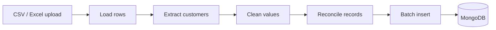
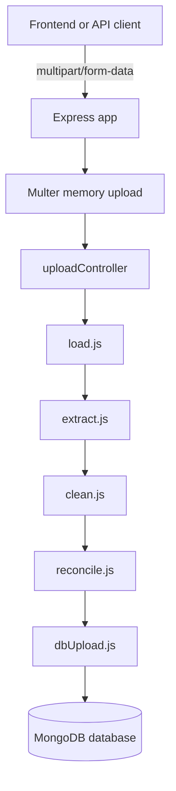
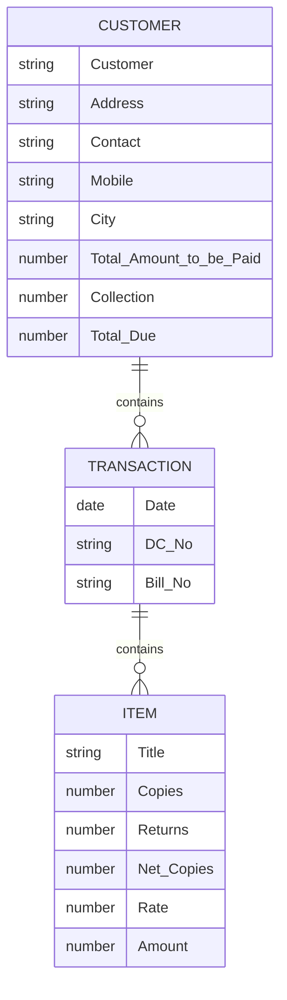

# StarQ Backend

[](https://nodejs.org/)
[](https://www.mongodb.com/)
[](#api-reference)
[](#upload-rules)

StarQ Backend is an Express and MongoDB ETL service for processing distributor billing spreadsheets. It accepts CSV or Excel uploads, extracts customer billing sections, cleans numeric and date fields, reconciles customer records, and stores one nested MongoDB document per customer.

## Table of Contents

- [Overview](#overview)
- [Architecture](#architecture)
- [ETL Pipeline](#etl-pipeline)
- [Project Structure](#project-structure)
- [Getting Started](#getting-started)
- [Environment Variables](#environment-variables)
- [API Reference](#api-reference)
- [MongoDB Document Shape](#mongodb-document-shape)
- [Upload Rules](#upload-rules)
- [Development Notes](#development-notes)
- [Troubleshooting](#troubleshooting)

## Overview

This backend is designed for spreadsheet-first billing workflows where each uploaded file contains customer blocks, transactions, line items, collections, and due amounts.

The pipeline turns spreadsheet rows into clean customer documents:



Key capabilities:

- Accepts `.csv`, `.xlsx`, and `.xls` files through a multipart upload endpoint.
- Parses files in memory without writing temporary upload files to disk.
- Normalizes spreadsheet rows to a consistent 9-column layout.
- Builds nested customer documents with transactions and line items.
- Converts numeric totals, collections, dues, copies, rates, and amounts.
- Stores results in the MongoDB collection selected by the request.
- Returns a compact summary and preview after every successful upload.

## Architecture



## ETL Pipeline

| Step | Module | Purpose |
| --- | --- | --- |
| 1 | `src/pipeline/load.js` | Reads CSV or Excel buffers and normalizes each row to 9 columns. |
| 2 | `src/pipeline/extract.js` | Detects customer blocks, transactions, bill numbers, line items, and due summaries. |
| 3 | `src/pipeline/clean.js` | Converts strings into typed values such as numbers, dates, and cleaned mobile strings. |
| 4 | `src/pipeline/reconcile.js` | Removes blank customer rows and sanitizes undefined values before database insert. |
| 5 | `src/pipeline/dbUpload.js` | Inserts final customer documents into the selected MongoDB collection in batches. |

## Project Structure

```text
DBBackend/
|-- server.js
|-- package.json
|-- README.md
|-- src/
|   |-- app.js
|   |-- config/
|   |   |-- collections.js
|   |   `-- db.js
|   |-- controllers/
|   |   `-- uploadController.js
|   |-- middleware/
|   |   `-- upload.js
|   |-- pipeline/
|   |   |-- load.js
|   |   |-- extract.js
|   |   |-- clean.js
|   |   |-- reconcile.js
|   |   `-- dbUpload.js
|   |-- routes/
|   |   `-- index.js
|   `-- utils/
|       `-- helpers.js
```

## Getting Started

### Prerequisites

- Node.js 18 or later
- npm
- MongoDB Atlas or a local MongoDB instance

### Installation

```bash
npm install
```

### Configure Environment

Create a `.env` file in the `DBBackend` directory:

```env
PORT=8000
MONGO_URI=mongodb+srv://<username>:<password>@<cluster-url>/?appName=<app-name>
DB_NAME=StarQ
BATCH_SIZE=1000
```

Do not commit real database credentials. The existing `.gitignore` already excludes `.env`.

### Run the Server

Production:

```bash
npm start
```

Development with auto-restart:

```bash
npm run dev
```

When running locally, the API is available at:

```text
http://localhost:8000
```

## Environment Variables

| Variable | Required | Default | Description |
| --- | --- | --- | --- |
| `PORT` | No | `8000` | HTTP port used by the Express server. |
| `MONGO_URI` | Yes | Empty string | MongoDB connection string. |
| `DB_NAME` | No | `StarQ` | MongoDB database name. |
| `BATCH_SIZE` | No | `1000` | Number of documents inserted per MongoDB batch. |

## API Reference

### Health Check

```http
GET /health
```

Response:

```json
{
  "status": "ok",
  "timestamp": "2026-06-18T10:30:00.000Z"
}
```

### Upload Spreadsheet

```http
POST /upload
Content-Type: multipart/form-data
```

Required form fields:

| Field | Type | Description |
| --- | --- | --- |
| `file` | File | CSV, XLSX, or XLS billing spreadsheet. |
| `pipeline` | String | MongoDB collection name to insert into, for example `customers`. |

Example using cURL:

```bash
curl -X POST http://localhost:8000/upload \
  -F "file=@./billing.xlsx" \
  -F "pipeline=customers"
```

Successful response:

```json
{
  "status": "success",
  "filename": "billing.xlsx",
  "file_size_kb": 142.5,
  "collection": "customers",
  "summary": {
    "customers": 48,
    "transactions": 320,
    "line_items": 1280,
    "customers_with_dues": 14,
    "columns": [
      "Customer",
      "Address",
      "Contact",
      "Mobile",
      "City",
      "Total_Amount_to_be_Paid",
      "Collection",
      "Total_Due"
    ]
  },
  "preview": [
    {
      "Customer": "Sample Customer",
      "City": "Hyderabad",
      "Total_Amount_to_be_Paid": 25000,
      "Collection": 20000,
      "Total_Due": 5000,
      "transaction_count": 3,
      "item_count": 18,
      "first_transaction": {
        "Date": "2026-06-18",
        "DC_No": "DC-001",
        "Bill_No": "B.No.001",
        "items": [
          {
            "Title": "Sample Item",
            "Copies": 10,
            "Amount": 500
          }
        ]
      }
    }
  ]
}
```

Missing `pipeline` response:

```json
{
  "status": "error",
  "message": "Missing required field: \"pipeline\" (collection name)."
}
```

## MongoDB Document Shape

Each customer is stored as a single nested document:

```json
{
  "Customer": "Customer name",
  "Address": "Customer address",
  "Contact": "Contact person",
  "Mobile": "9999999999",
  "City": "City",
  "Total_Amount_to_be_Paid": 25000,
  "Collection": 20000,
  "Total_Due": 5000,
  "Transactions": [
    {
      "Date": "2026-06-18T00:00:00.000Z",
      "DC_No": "DC-001",
      "Bill_No": "B.No.001",
      "Items": [
        {
          "Title": "Item name",
          "Copies": 10,
          "Returns": 0,
          "Net_Copies": 10,
          "Rate": 50,
          "Amount": 500
        }
      ]
    }
  ]
}
```



## Upload Rules

| Rule | Value |
| --- | --- |
| Accepted extensions | `.csv`, `.xlsx`, `.xls` |
| Maximum file size | 50 MB |
| Storage strategy | In-memory buffer via Multer |
| Upload field name | `file` |
| Collection field name | `pipeline` |

The upload middleware accepts common spreadsheet MIME types and also allows fallback MIME types such as `text/plain` and `application/octet-stream` when operating systems do not report CSV files consistently.

## Development Notes

### Add a New Route

1. Create a controller in `src/controllers/`.
2. Import the controller in `src/routes/index.js`.
3. Register the route on the shared Express router.

### Add a New Pipeline Step

1. Create a new module in `src/pipeline/`.
2. Keep the function focused on one transformation.
3. Import and run it from `src/controllers/uploadController.js`.
4. Update this README if the API response or stored document shape changes.

### Database Batching

MongoDB inserts are performed in batches using `BATCH_SIZE` from `src/config/collections.js`. This keeps large uploads more predictable and avoids inserting one document at a time.

## Troubleshooting

| Symptom | Likely Cause | Fix |
| --- | --- | --- |
| `Missing required field: "pipeline"` | The upload request did not include the collection name. | Add `-F "pipeline=customers"` or include `pipeline` in the frontend form data. |
| `Only .csv, .xlsx, and .xls files are accepted.` | Unsupported file extension or MIME type. | Upload a supported spreadsheet file. |
| MongoDB connection error | Invalid `MONGO_URI`, network issue, or IP not allowed in Atlas. | Check credentials, cluster URL, and Atlas network access settings. |
| Empty or unexpected records | Spreadsheet format does not match the expected customer block layout. | Confirm the file contains `Customer:`, `DC-`, `B.No.`, and `Total Due` markers. |

## Scripts

| Command | Description |
| --- | --- |
| `npm start` | Start the Express server with Node.js. |
| `npm run dev` | Start the server with Nodemon for development. |

## Security Notes

- Keep `.env` private and never commit real MongoDB credentials.
- Prefer least-privilege MongoDB users for production deployments.
- Validate collection names at the frontend or add a backend allowlist if uploads should only target known collections.
- Consider adding authentication before exposing this API outside a trusted network.
